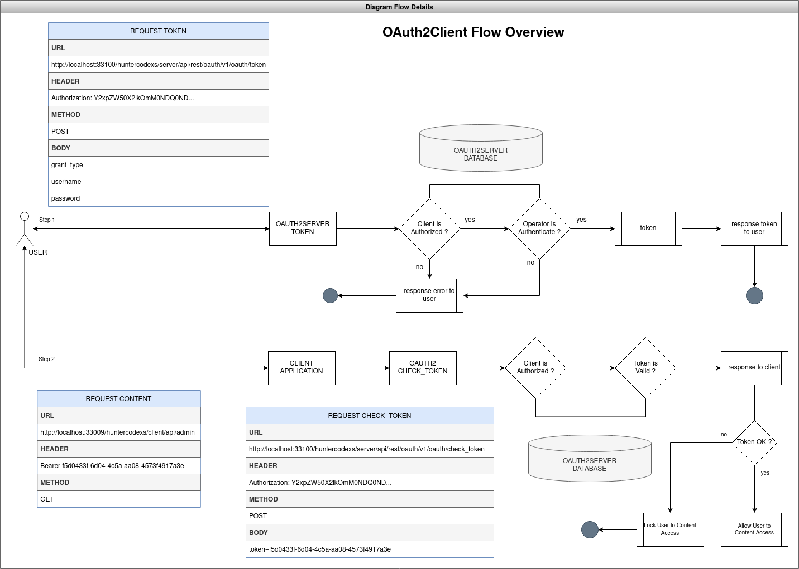
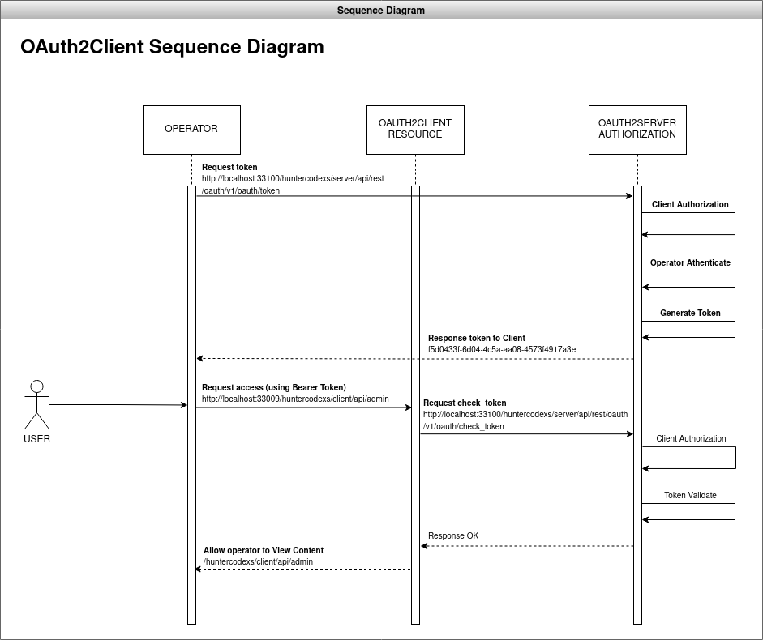

# OAUTH2 CLIENT DEMO
Just an OAuth2 Client

# Resources

* MVC
* Maven Project
* Java 8 (jdk-8u212)
* Spring Boot 2.0.1.RELEASE

# Dependencies

* Lombok
* Spring Data JPA
* Mysql Driver Connector
* Spring Rest Docs
* Spring Web
* OAuth2 (Resource Server)
* Service Discovery
* Zipkin
* Prometheus
* ELK

----

<h4>Details</h4>
<pre>
JDK
$ javac -version
javac 1.8.0_212

JRE
$ java -version
java version "1.8.0_212"
Java(TM) SE Runtime Environment (build 1.8.0_212-b10)
Java HotSpot(TM) 64-Bit Server VM (build 25.212-b10, mixed mode)
</pre>

# Overview

> About

This project only can be used as the OAuth2 Resource Server, ie, is not possible generate token.

> Diagrams

- Diagram Flow Detailed

- Diagram of Sequence

> How to use

Please, before starting this project have sure that the steps is already completed:

- Create the database: demo
- Create the tables and insert data into database demo from file: src/main/resources/database.sql
- Check if the Service Discovery is available to register
- Use the postman file as support to make a tests

# Postman

> Use the postman file to make tests

src/main/resources/OAUTH2-CLIENT-DEMO.postman_collection.json

> In this postman file exists three requests

- Admin
  - http://localhost:33009/huntercodexs/client/api/admin
- User
  - http://localhost:33009/huntercodexs/client/api/user
- Others
  - http://localhost:33009/huntercodexs/client/api/others

# About the OAuth2

> How to authorize access via OAuth2 using Postman

To perform authentication and authorization via OAUTH2, follow the instructions below (as shown in the image):

1- Configure the REQUEST URL as needed, example: [GET] http://localhost:33009/huntercodexs/client/api/user

2- Click on the Authorization tab of the REQUEST

3- Choose as in Request Type OAuth 2.0

4- Choose in "Add authorization data to" the value Request Headers

5- In Header Prefix, enter the Bearer value

6- In Grant Type choose Password Credentials

7- In access token URL, enter the URL where the OAUTH2 service is running and managing the tokens, for example: http://localhost:33100/huntercodexs/server/api/rest/oauth/v1/oauth/token

8- In Client ID, enter the id of the client that is previously registered in the system or service, for example: client_auth_id

9- In Client Secret, enter the secret that the client must use to authenticate in the API

10- In Username, enter the username, for example: OAUTH2DEMO_USER

11- In Password, enter the user's access password, for example: 1234567890

12- In Client Authentication choose "Send as Basic Auth header"

13- Click on the "Get New Access Token" button

14- Synchronize the token generated in the application environment by including the token in the Request Header

> HINT
> 
> Use the OAUTH2-CLIENT-DEMO.postman_collection.json file to speed up development and test
